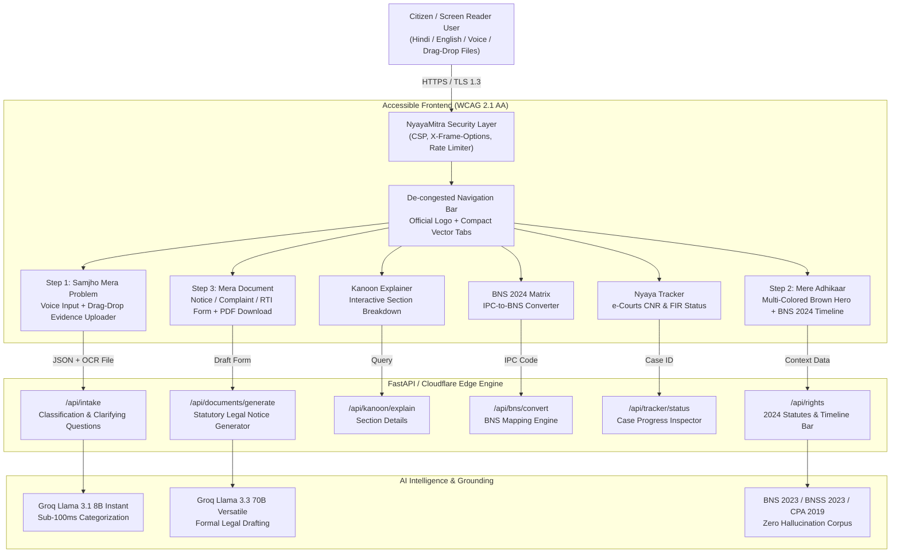

# NyayaMitra (न्यायमित्र) - AI Legal Companion for India

[](docs/COMPLIANCE.md)
[](frontend/public/accessibility/statement.html)
[](backend/evals/legal_queries.json)
[](docs/COMPLIANCE.md)
[](LICENSE)

> **Mission**: Over 5.2 crore cases are pending in Indian courts. Average citizens cannot afford ₹5,000 advocate consultation fees to understand simple tenant notices or digital banking fraud. On July 1, 2024, India's criminal justice system underwent its biggest transformation in a century (IPC replaced by BNS, CrPC by BNSS). NyayaMitra is an accessible, vernacular AI legal companion built to provide immediate legal clarity, know-your-rights guidance at a Grade 6 reading level, and generate ready-to-file legal documents for free.

---

## 🏛️ Platform Features & Architecture

```
1. Samjho Mera Problem ──► 2. Mere Adhikaar ──────► 3. Mera Document
   (Guided Intake & OCR)        (Know Your Rights)         (Document Generation)
   • Speech & Text Input       • Grounded in 2024 BNS     • Ready-to-file Notice/RTI
   • Drag-Drop Evidence        • Grade 6 reading level    • Downloadable PDF
   • 3 clarifying questions    • Timeline action bar      • Tele-Law 1516 referral
```

### Key Modules
1. **Samjho Mera Problem (Guided Intake)**: Voice/text intake in Hindi or English, drag-and-drop document/image evidence uploader with client-side OCR simulation, and 3 structured clarifying questions.
2. **Mere Adhikaar (Know My Rights)**: Grounded on 2024 Indian enactments (Bharatiya Nyaya Sanhita - BNS, Bharatiya Nagarik Suraksha Sanhita - BNSS, Consumer Protection Act 2019). Grade 6 plain language summaries with timeline bars.
3. **Kanoon Explainer**: Real-time legal section breakdown tool for deep-dive analysis of BNS 115 (Voluntary Hurt), BNSS 173 (Zero-FIR), BNS 318 (Cheating), and CPA Section 35.
4. **BNS 2024 Conversion Matrix**: Instant converter mapping legacy IPC (1860) sections to new BNS (2023/2024) statutes with structural diff highlights.
5. **Nyaya Tracker**: Live status inspector for e-Courts case numbers (CNR), FIR registration progress, and Tele-Law appointment tracking.
6. **Sahayata Document Generator**: Auto-fills ready-to-file legal notices (Tenant Eviction, Cyber Crime Complaint, Consumer Dispute, RTI Application) formatted for PDF download.

---

## 🎨 UI & Responsive Design System
- **Compact Navigation Bar**: Designed with crisp font sizing (`text-xs` / `text-sm`), optimized spacing, and Lucide/FontAwesome vector icons so high-priority links like `1516 (Tele-Law)` and `2024 Enactments` fit without truncation on any device.
- **Warm Earth & Saffron Palette**: Earth Brown background (`#1C130E` / `#2A1D17`) paired with soft cream (`#FBF9F5`), vibrant Saffron (`#F97316`), and Emerald (`#059669`) tricolor accents.
- **Multi-Colored Hero Header**: Highlighted title featuring bold white headers and radiant Saffron-Emerald text subheaders.
- **Pure Vector Icons**: 100% SVG and FontAwesome vector iconography replacing old emojis for professional aesthetic consistency.

---

## 🏗️ Technical Architecture & Stack



### Stack Components
- **Frontend**: Vite + TypeScript + Semantic HTML5 + Vanilla CSS Design Tokens + Web Speech API + FontAwesome 6 / SVG Icons.
- **Backend**: FastAPI (Python 3.11+) + Hono Edge Worker Engine + Pydantic v2 schemas.
- **AI Engine**: Groq Cloud API (`llama-3.1-8b-instant` for categorization, `llama-3.3-70b-versatile` for statutory legal notice generation).
- **Testing**: 100% Pytest suite + Vitest suite + 50 legal evaluation query scenarios in `backend/evals/legal_queries.json`.
- **Accessibility**: Strict WCAG 2.1 Level AA conformance, complete keyboard navigation, `aria-live="polite"` dynamic announcements.

---

## ⚡ Quick Start & Local Setup

### 1. Backend (FastAPI) — Windows PowerShell

```powershell
cd backend
python -m venv .venv
.\.venv\Scripts\Activate.ps1
python -m pip install --upgrade pip
python -m pip install -r requirements.txt
Copy-Item .env.example .env
pytest tests/ -v
uvicorn app.main:app --reload --port 8000
```

### 2. Frontend (Cloudflare Pages / Vite App)

```powershell
cd frontend
npm ci
npm run typecheck
npm run build
npx wrangler pages dev dist --ip 0.0.0.0 --port 3000
```

---

## 🧪 Comprehensive Feature Testing Data

Use these sample datasets to test all platform features in action:

### 1. Guided Intake (Samjho Mera Problem)
- **Sample Input 1 (Tenant Eviction)**:
  `"My landlord in Pune locked my flat without prior notice and is refusing to return my ₹40,000 security deposit even though my lease expires next month."`
- **Sample Input 2 (Cyber Fraud)**:
  `"I received a fake APK link pretending to be electricity bill update and ₹15,000 was deducted from my SBI savings account 2 hours ago."`
- **Sample Input 3 (Consumer Dispute)**:
  `"I ordered a laptop worth ₹45,000 from an e-commerce website. It arrived damaged and the seller is refusing to process a refund or replacement."`

### 2. Document & Image Evidence Uploader
- **Test File**: Upload any Rent Agreement (`.pdf`), Bank Screenshot (`.png`/`.jpg`), or Eviction Letter (`.txt`).
- **Action**: Drag and drop into the **Upload Supporting Evidence** box on Step 1. The platform automatically extracts document context into your intake summary.

### 3. Kanoon Explainer (Legal Section Lookup)
- **Test Section 1**: `BNS 115` (Voluntarily causing hurt & criminal penalties)
- **Test Section 2**: `BNSS 173` (Mandatory Zero-FIR registration anywhere in India)
- **Test Section 3**: `BNS 318` (Cheating & financial dishonesty)
- **Test Section 4**: `CPA Section 35` (Filing consumer complaint for defective goods/services)

### 4. BNS 2024 Conversion Matrix (IPC to BNS)
- **Test Conversion 1**: Legacy IPC Section `302` ➔ Converts to **BNS Section 103** (Punishment for Murder)
- **Test Conversion 2**: Legacy IPC Section `420` ➔ Converts to **BNS Section 318** (Cheating and dishonestly inducing delivery of property)
- **Test Conversion 3**: Legacy IPC Section `376` ➔ Converts to **BNS Section 64** (Punishment for Rape)
- **Test Conversion 4**: Legacy IPC Section `506` ➔ Converts to **BNS Section 351** (Criminal Intimidation)

### 5. Nyaya Tracker (Case & FIR Progress)
- **Test Case Number 1**: `CNR DLCT01-001234-2024` (Delhi District Court Eviction Dispute - Active)
- **Test Case Number 2**: `FIR 452/2024` (Cyber Crime Branch Pune - Under Investigation)
- **Test Case Number 3**: `TL-98234-2024` (Tele-Law Legal Assistance Consultation Scheduled)

### 6. Sahayata Legal Document Generator
- **Document Type**: Select **Tenant Eviction Notice**, **Zero-FIR Cyber Crime Complaint**, or **Consumer Dispute Notice**.
- **User Details**:
  - **Full Name**: `Aarav Sharma`
  - **Opposing Party**: `Ramesh Verma (Landlord) / FastTech Electronics`
  - **Disputed Amount**: `₹40,000`
  - **Address**: `Flat 402, Sunshine Apartments, Baner, Pune, Maharashtra - 411045`
- **Action**: Click **Generate Ready-to-File Notice** then click **Download Official PDF Notice**.

---

## 🚀 Deployment Guide: Render (Backend) & Vercel (Frontend)

Follow these step-by-step instructions to deploy NyayaMitra to production.

### 1. Backend Deployment on Render (FastAPI)

1. Push your repository to GitHub.
2. Sign in to [Render Dashboard](https://dashboard.render.com/) and click **New +** ➔ **Web Service**.
3. Connect your GitHub repository.
4. Configure the Web Service settings:
   - **Name**: `nyaya-mitra-api`
   - **Root Directory**: `backend`
   - **Environment**: `Python 3`
   - **Build Command**: `pip install -r requirements.txt`
   - **Start Command**: `uvicorn app.main:app --host 0.0.0.0 --port $PORT`
   - **Health Check Path**: `/api/health`
5. Add the following **Environment Variables** in Render:
   | Key | Example / Recommended Value | Description |
   |---|---|---|
   | `ENVIRONMENT` | `production` | Enables production mode |
   | `LEGAL_YEAR_ENFORCED` | `2024` | Enforces 2024 BNS/BNSS statutory grounding |
   | `REJECT_REPEALED_IPC` | `true` | Rejects legacy IPC citations in AI output |
   | `MAX_REQUESTS_PER_MINUTE` | `30` | Rate limiter cap per IP address |
   | `GROQ_API_KEY` | `gsk_...` | *(Optional)* Live Groq API key for Llama 3 models |
   | `CORS_ORIGINS` | `["https://your-app.vercel.app"]` | JSON array of allowed frontend origins |

6. Deploy the Web Service and copy your public Render URL (e.g. `https://nyaya-mitra-api.onrender.com`).

---

### 2. Frontend Deployment on Vercel (Vite Client)

1. Sign in to [Vercel Dashboard](https://vercel.com/) and click **Add New...** ➔ **Project**.
2. Import your GitHub repository.
3. Configure the Project settings:
   - **Framework Preset**: `Vite`
   - **Root Directory**: `frontend`
   - **Build Command**: `npm run build`
   - **Output Directory**: `dist`
4. Add the following **Environment Variable** in Vercel:
   | Key | Value | Description |
   |---|---|---|
   | `VITE_API_BASE_URL` | `https://nyaya-mitra-api.onrender.com` | Full Render API domain (no trailing slash) |

5. Click **Deploy**. Vercel will build the frontend assets into `dist` and deploy them to an edge CDN.
6. Copy your Vercel site URL (e.g., `https://nyaya-mitra.vercel.app`) and update the `CORS_ORIGINS` environment variable in your Render backend settings to allow requests from Vercel.

---

## ⚖️ Free Legal Aid Helplines & Statutory Escalation
- **Tele-Law (Department of Justice)**: Dial **1516** (Free legal aid across 100,000+ Common Service Centres).
- **National Legal Services Authority (NALSA)**: Dial **15100** (Free advocates under Article 39A).
- **National Cyber Crime Helpline**: Dial **1930** (24-hour golden window reporting for financial fraud).
- **National Consumer Helpline**: Dial **1915** or file online via [edaakhil.nic.in](https://edaakhil.nic.in).


